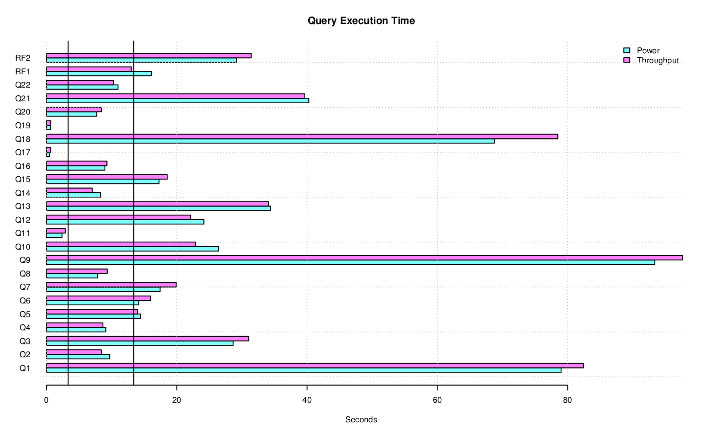

====================================
Database Test 3 (DBT-3) User's Guide
====================================

.. image:: osdl-logo.png
   :width: 600
   :alt: OSDL Logo

Copyright (c) 2002 by The Open Source Development Laboratory, Inc. This
material may be distributed only subject to the terms and conditions set forth
in the Open Publication License, v1.0 or later (the latest version is currently
available at http://www.opencontent.org/openpub/). Distribution of
substantively modified versions of this document is prohibited without the
explicit permission of the copyright holder.

Other company, product or service names may be trademarks or service marks of
others.

Contributors to this document include:

* Jenny Zhang (OSDL)
* Mary Edie Meredith (OSDL)
* Mark Wong (OSDL)

.. contents:: Table of Contents

------------
Introduction
------------

This document provides instructions on how to set up and use the Open Source
Development Lab's Database Test 3 (DBT-3) kit.  This kit provides what is
needed to execute a workload similar to the TPC-H workload.

----------------
Installing DBT-3
----------------

The latest stable and development version of the kit can be found on GitHub:
https://github.com/osdldbt/dbt3

The TPC's TPC-H Tools cannot be redistributed with DBT-3 and must be downloaded
by the tester:
https://www.tpc.org/tpc_documents_current_versions/current_specifications5.asp

Required Software
=================

In addition to the database management system software, the following is also
required:

* bc
* SQLite https://www.sqlite.org/index.html
* **sar**, **pidstat** http://pagesperso-orange.fr/sebastien.godard/ (While the
  scripts assume this particular version of **sar** and **pidstat**, it is
  possible to run on non-Linux based operating systems with some modifications
  to the kit.)

------------
User's Guide
------------

Building TPC-H Tools
====================

The kit requires the TPC-H Tools to be built for the specific database
management system to be tested.  The TPC-H Tools is developed in such a way
that it needs to rebuilt or another copy needs to be built if a different
database management system is to be tested.

DBT-3 provides a script to apply patches and compile the TPC-H Tools.  The
patches that are applied are minor code changes and query templates to make the
TPC-H Tools work with the databases supposed by DBT-3.

For example, to build the TPC-H Tools for PostgreSQL (pgsql), unzip the TPC-H
Tools zip file and run `dbt3-build-dbgen` against the resulting directory::

    unzip *-tpc-h-tool.zip
    dbt3-build-dbgen pgsql "TPC-H V3.0.1"/

Quick Start
-----------

Once the TPC-H Tools is built, only one command needs to be issued to run a
complete test::

    dbt3-run --tpchtools="TPC-H V3.0.1" pgsql /tmp/results

This will run the generate the data files for a 1 GB scale factor database
load, power and throughput test, with 2 streams, against PostgreSQL and save
the results of the test in `/tmp/results`.

The *dbt3-run* script can be used to run any combination of a load test, power
test, and throughput test.  A load tests must be run in order to create the
database before a power or throughput tests can be run individually.

Advanced Notes
==============

Setting DBT-3 Environment Variables
-----------------------------------

**dbgen**, **qgen** require specific environment variables to be set in order
to function properly.  The following environment variables are required to be
set if run manually, otherwise the *dbt3-run* script will set the variables
based on the given command line arguments:

* `DSS_PATH=/tmp/dss` - Absolute path in which to build flat files.
* `DSS_QUERY=${TPCHTOOLS}/dbgen/queries` - Absolute path in which to find query
  templates.
* `DSS_CONFIG=${TPCHTOOLS}/dbgen` - Directory in which to find **dbgen**
  configuration files.

Testers can choose to run all the tests in DBT-3 as well as part of the tests.
The following section describes how to run all the tests.

Tester may also create several databases so that several scale factors can be
tested or various implementation strategies compared.  They will only need to
change environment variables to point to the correct database prior to
executing the test kit scripts.

Each DBMS may have additional environment variables that may need to be set.
See the database management system specific section for details.

--------------
Workload Notes
--------------

Sizing the System
=================

The scale factor can actually be any decimal number (like 1.1 or 50) so that
if the tester wishes, the tester can create a database whose size is not one
of the officially permitted scale factors.  This might be desirable for
development purposes.  Any results should be advertised with the scale factor
used, since the performance varies based on the amount of data required for
processing the queries.  The database size is defined with reference to scale
factor.  For example, for scale factor 1, the raw data files' total size is
roughly 1 GB.

Note:  This kit does not support scale factors less than 1.  Although you can
build a database using scale factors less than 1, the query generator
(**qgen**) will not generate the proper variable values that correspond to
scale factors less than 1.

The tester needs to allocate space for the flat files generated by **dbgen**
used to load the database.  Once the database is loaded and backed up, there is
no need to retain these flat files.

QGEN
====

The `qgen` program can be manually run to inspect the SQL statement to that
will be executed by the test.

For example (see `qgen -h` for option descriptions) to see what the first
query to be executed::

    qgen -c -r 0 -p 0 -s 1 5

Results in the following query for PostgreSQL::

    -- using 0 as a seed to the RNG
    -- @(#)14.sql	2.1.8.1
    -- TPC-H/TPC-R Promotion Effect Query (Q14)
    -- Functional Query Definition
    -- Approved February 1998
    BEGIN;
 
 
 
    select
 	   100.00 * sum(case
 		   when p_type like 'PROMO%'
 			   then l_extendedprice * (1 - l_discount)
 		   else 0
 	   end) / sum(l_extendedprice * (1 - l_discount)) as promo_revenue
    from
 	   lineitem,
 	   part
    where
 	   l_partkey = p_partkey
 	   and l_shipdate >= date '1993-01-01'
 	   and l_shipdate < cast(date '1993-01-01' + interval '1 month' as date);
    COMMIT;

-----------------------------------------
Database Management System Specific Notes
-----------------------------------------

MonetDB
=======

Environment Variables
---------------------

* `DBDATA=/tmp/monetdb` - This defines where to initialize the MonetDB data
  directory
* `DBNAME=dbt3` - This is the database name to use.

MySQL/MariaDB
=============

When using **mysqladmin** to start the database, options will be loaded from one
of these locations, if they exist: `/etc/my.cnf`, `/etc/mysql/my.cnf`, or
`~/.my.cnf`.  The environment variable `MYSQL_HOME` can also be used to
specify where a *my.cnf* file exists.

Environment Variables
---------------------

* `DBNAME=dbt3` - This is the database name to use.
* `MYDATA=/tmp/mydata` - This defines where to initialize the MySQL data
  directory

PostgreSQL
==========

Environment Variables
---------------------

* `PGDATABASE=dbt3` - This is the database name to use.
* `PGDATA=/tmp/pgdata` - This defines where the PostgreSQL instance will be
  created.
* `DEFAULT_LOAD_PARAMETERS="-c shared_buffers=1GB"` - This defines the
  database parameters to be set for the load test.  The syntax is that same as
  that used to set parameters from the command line as if using **pg_ctl**.
  (e.g. "-c shared_buffers=1GB")
* `DEFAULT_POWER_PARAMETERS=""` - This defines the database parameters to set
  for the power test.
* `DEFAULT_THROUGHPUT_PARAMETERS=""` - This defines the database parameters
  to be set for the throughput test.

Query Execution Plans
---------------------

There is an additional `--explain` flag that can be used for testing PostgreSQL
with the *dbt3-* script that will execute the queries in the power and
throughput tests using `EXPLAIN (ANALYZE, BUFFERS)` thus returning actual
execution plans instead of the query results.

If the `--explain` flag is used, an additional plan disaster report will be
generating showing which queries grossly misestimated the number of rows
returned at each node of the plan.

Postgres-XL
===========

Environment Variables
---------------------

In addition to the PostgreSQL environment variables, Postgres-XL requires the
following:

* `GTMHOST="pgxl"` - Hostname for the GTM master and Coordinator node.
* `HOSTNAMES="pgxl1 pgxl2"` - A space-delimited list of hostnames for the
  Datanodes.export GTMDATA="$PGDATA/gtm"
* `COORDINATORDATA="$PGDATA/coordinator"` - Data directory for the Coordinator.
* `GTMPROXYDATA="$PGDATA/gtm_proxy."` - Data directory prefix for the GTM
  proxy.  The node number will be automatically appended to the end.
* `DATANODEDATA="$PGDATA/datanode."` - Data directory prefix for the Datanode.
   The node number will be automatically appended to the end.
* `DNPN=2` - Number of datanodes to create per system node.
* `DNBP=15432` - Starting listener port number for datanodes.
* `DNBPP=25432` - Starting listener port number for datanode pooler.

Postgres-XL Architecture
------------------------

See additional notes for the base PostgreSQL version for items that also apply
to Postgres-XL.

A Postgres-XL cluster can be built in many different ways.  The scripts in this
kit builds them only in one specific configuration::

                       +-------------+
                       | GTM Master  |
                       | Coordinator |
                       +-------------+
                      /       |       \
                     /        |        \
                    /         |         \
                   /          |          \
    +-------------+    +-------------+    ...
    |  GTM Proxy  |    |  GTM Proxy  |
    |  Datanode   |----|  Datanode   |----
    +-------------+    +-------------+

Virtuoso
========

In order to keep the scripts simple, the installation of this software needs to
be the same as the user that will be executing the test kit.  The reason for
this is because the database location is tied to the parameters set when
running the Virtuoso configure script.

Environment Variables
---------------------

* `VADDIR=/usr/local/virtuoso-opensource/var/lib/virtuoso/db` - Location of
  *virtuoso.ini* file.

-------
Results
-------

The results directory created from running tests with the *dbt3-run* script
will contain the calculated metrics of the test as well as charts of the system
and database statistics summarized in the *index.html* file in the results
directory.

The query results chart display the execute time of each query for the power
test, and the arithmetic mean of each of the streams in the throughput test.

The links to the load test, power test, and throughput test summaries will have
links to processor and disk utilization charts as well as operating system and
database parameters used in each test.  The power test and throughput test will
also have links to the query plans and query results.

-----------------
Developer's Guide
-----------------

Query Templates
===============

The TPC-H Tools includes the official query syntax for the benchmarks in
`dbgen/queries`.  DBT-3's `dbt3-build-dbgen` script populates the TPC-H Tools
subdirectory with query templates for the databases it supports from DBT-3's
`queries` directory.

For example the PostgreSQL queries are in DBT-3 `queries/pgsql` and is copied
to TPC-H Tools' `dbgen/queries/pgsql` when `dbt3-build-dbgen` is executed.
